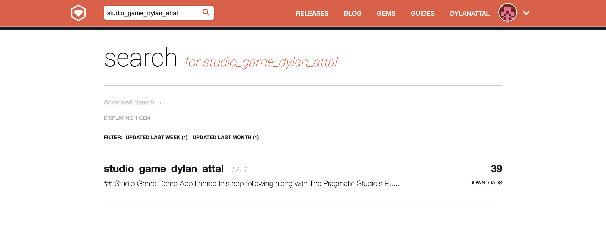

## Studio Game Demo App

I made this app following along with [The Pragmatic Studio's Ruby course](https://pragmaticstudio.com/courses/ruby).

## Install the gem

I published the gem for this app on [RubyGems.org](https://rubygems.org/).



In order to install it, run

`gem install studio_game_dylan_attal-1.0.0.gem`

## Run the app

In order to run the app run the following command

`studio_game`

## Summary

This is a console app that simulates a game.

Players are loaded from the `players.csv` file be default. Each player has a name and a starting health value, i.e.:

`Larry,100`

If the user wants, they can provide a different CSV file to load the players. For example, I've provided a file `my_favorite_players.csv` as an alternate list of players. The user should provide the file like so

`studio_game bin/my_favorite_players.csv`

Before the game is played, the user gets to decide how many rounds to play. At this point, the user can also terminate the program by typing in `quit` or `exit`:

`How many game rounds? ('quit to exit')`

Once the user provides the number of rounds, the game is played automatically. The user then sees

1. Which players are involved

```
There are 5 players in Knuckleheads:
I'm Boba with a health = 100, points = 0, and score = 100.
I'm Jango with a health = 90, points = 0, and score = 90.
I'm Din with a health = 80, points = 0, and score = 80.
I'm Klutz with a health = 105, points = 0, and score = 105.
I'm Berserker with a health = 50, points = 0, and score = 50.
```

2. Which treasures there are to find

```
There are 6 treasures to be found:
A pie is worth 5
A bottle is worth 25
A hammer is worth 50
A skillet is worth 100
A broomstick is worth 200
A crowbar is worth 400
```

3. The results of each round

```
Round 1
Rolled a 3 (StudioGame::Die)
Rolled a 4 (StudioGame::Die)
Boba has been skipped
Boba found a skillet worth 100 points.
Boba's treasures: {:skillet=>100}
I'm Boba with a health = 100, points = 100, and score = 200.
Rolled a 3 (StudioGame::Die)
Rolled a 2 (StudioGame::Die)
Jango got blammed!
Jango found a bottle worth 25 points.
Jango's treasures: {:bottle=>25}
I'm Jango with a health = 80, points = 25, and score = 105.
Rolled a 1 (StudioGame::Die)
Rolled a 6 (StudioGame::Die)
Din got w00ted!
Din found a crowbar worth 400 points.
Din's treasures: {:crowbar=>400}
I'm Din with a health = 95, points = 400, and score = 495.
Rolled a 1 (StudioGame::Die)
Rolled a 4 (StudioGame::Die)
Klutz has been skipped
Klutz found a bottle worth 12.5 points.
Klutz's treasures: {:bottle=>12.5}
I'm Klutz with a health = 105, points = 12.5, and score = 117.5.
Rolled a 1 (StudioGame::Die)
Rolled a 4 (StudioGame::Die)
Berserker has been skipped
Berserker found a hammer worth 50 points.
Berserker's treasures: {:hammer=>50}
I'm Berserker with a health = 50, points = 50, and score = 100.
```

Once the user quits, they see the final results of all the rounds:

```
How many game rounds? ('quit to exit')
quit
Knuckleheads Statistics:
2 strong players:
Boba (115)
Klutz (120)
3 wimpy players:
Jango (85)
Din (75)
Berserker (40)
Berserker........... 690
Boba................ 620
Din................. 575
Jango............... 235
Klutz............... 207.5

Boba's point totals:
100 total skillet points
5 total pie points
400 total crowbar points
505 grand total points

Jango's point totals:
50 total bottle points
100 total skillet points
150 grand total points

Din's point totals:
400 total crowbar points
100 total hammer points
500 grand total points

Klutz's point totals:
12.5 total bottle points
25.0 total hammer points
50.0 total skillet points
87.5 grand total points

Berserker's point totals:
50 total hammer points
200 total broomstick points
400 total crowbar points
650 grand total points
```

## Rules of the game

Each round, each player rolls the die.

If a player rolls between 1 and 2, then they are `blammed`, meaning they lose `10 health`.

If a player rolls between 3 and 4, then they are `skipped`, meaning they do not gain or lose points that turn.

If a player rolls between 5 and 6, then they are `w00ted`, meaning they gain `15 health`.

Each round, players can find treasure worth different points. Treasures are found randomly.

Every game, there are two special players added:

1. `ClumsyPlayer`: this player's treasure points are cut in half.
2. `BerserkPlayer`: once this player is `w00ted` five times, it cannot be `blammed` in that game anymore&mdash;if this player rolls between 1 and 2, they are `w00ted` instead of `blammed`.
